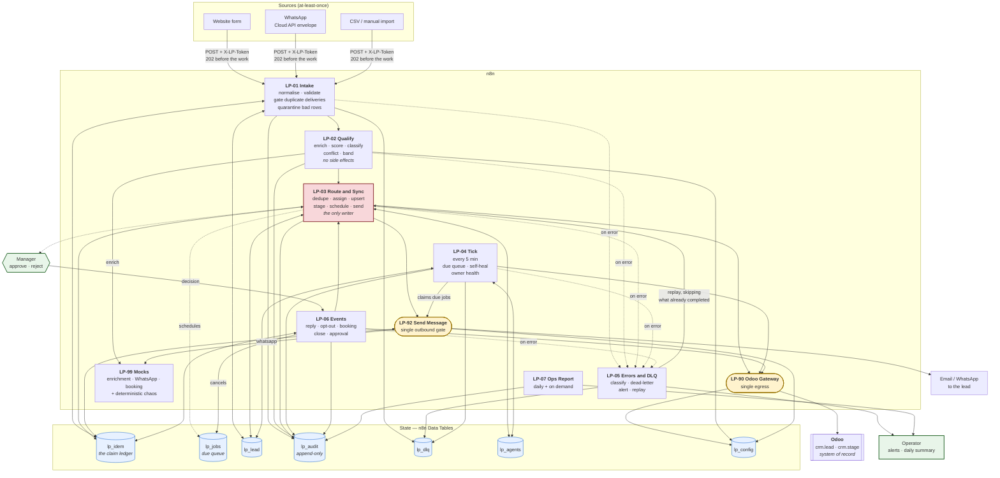
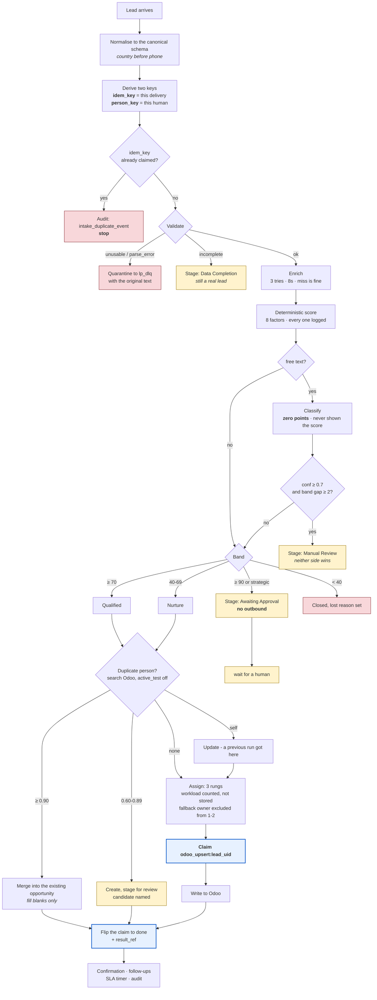
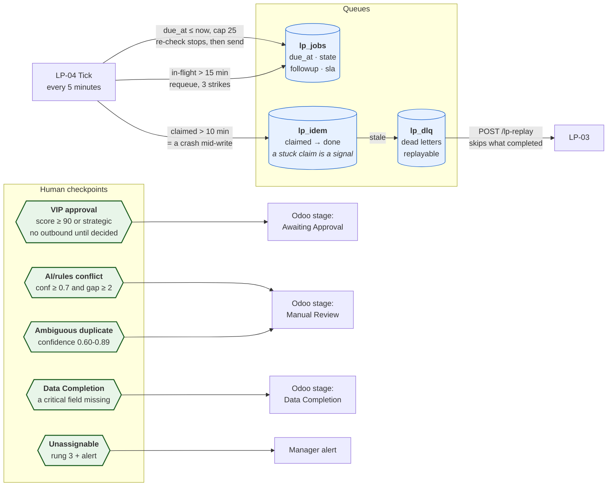
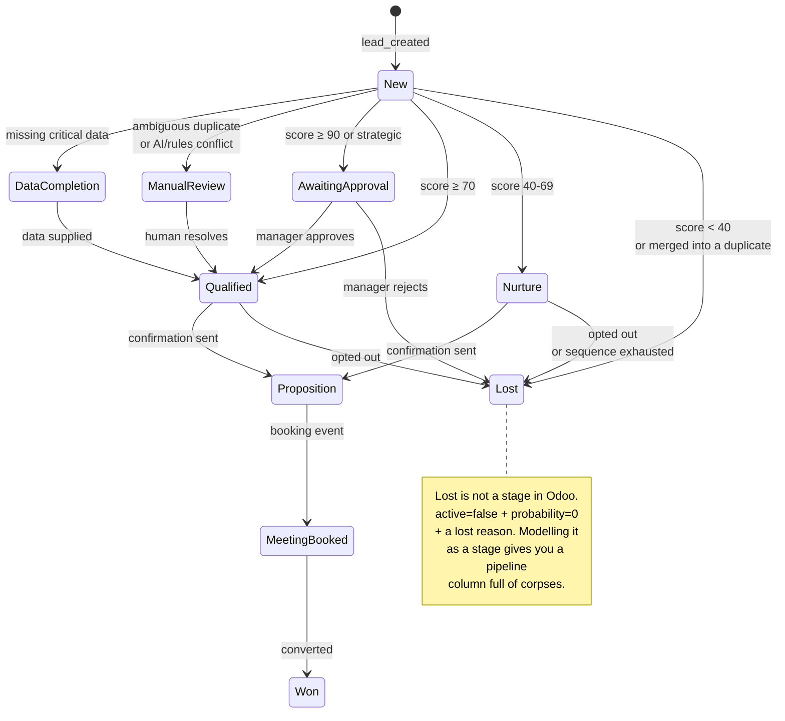

# Architecture

Mermaid, so it is version-controlled and renders natively on GitHub. Three views: the whole system,
the path one lead takes, and the human checkpoints.

---

## 1. The system

Three things the colours are saying:

- **Red is the only workflow that writes.** Every Odoo record, every message, every schedule
  originates in LP-03. Nothing else has side effects.
- **Yellow are the two gateways.** All Odoo traffic and all outbound messaging funnel through one
  node each, so retry policy, auth and the stop-condition recheck exist once.
- **`lp_idem` is touched by four workflows** because it is the claim ledger, and every side effect
  is claimed before it happens.

---

## 2. One lead's path

---

## 3. Queues and human checkpoints

The brief asks for queues and human checkpoints specifically, so they are called out on their own.

Every human checkpoint is **a stage in Odoo**, not a queue in a tool only the automation knows
about. The sales team's review list lives where they already work.

---

## The funnel

Stage transitions are a single lookup table (`C.STAGE_TRANSITIONS`). Nothing else in the system
moves a stage, so "when does a lead reach Qualified" has exactly one place to read.

---

## Reading the diagrams against the code

| On the diagram | In the repo |
|---|---|
| A workflow box | `02_Workflows/_src/<name>.js` (spec) and `02_Workflows/<name>.json` (built) |
| The claim ledger | `lp_idem`, and `C.intakeIdemKey` / `C.personKeyOf` in `_shared/constants.js` |
| The scoring box | `_shared/scorer.js`, unit-tested by `scripts/test-scoring.js` |
| The band decision | `C.bandFor` and `C.materiallyConflicts` |
| The stage table | `C.STAGE_TRANSITIONS` |
| The three assignment rungs | `C.pickOwner` |
